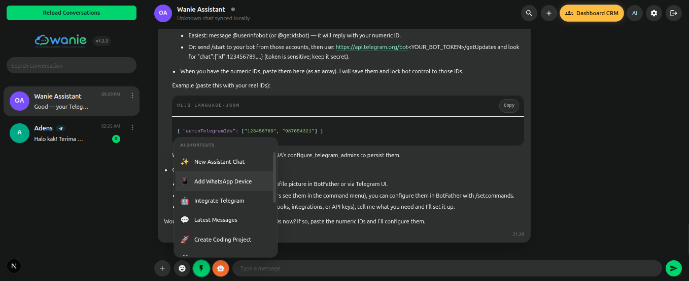

<p align="center">
  
</p>

# OpenWA

OpenWA is a self-hosted WhatsApp workspace that ships as a CLI package. It combines a Next.js dashboard, an Express API, Prisma-backed data access, Socket.IO realtime updates, media uploads, and runtime API documentation in a single local-first package.

OpenWA is also designed to be **AI-agent-ready**. The runtime exposes agent-friendly documentation, machine-readable OpenAPI output, and API key authentication so AI agents and automation tools can discover capabilities and interact with the workspace without reverse-engineering the app.

OpenWA also includes a **CRM AI workspace** for customer support automation. You can upload knowledge-base documents, generate AI drafts, enable guarded auto-replies, and serve both WhatsApp and Telegram customer conversations from the same dashboard.

## Disclaimer

OpenWA is an independent open source project. It is **not** an official WhatsApp product and is **not** affiliated with, endorsed by, or sponsored by Meta or WhatsApp.

If you use OpenWA with WhatsApp, make sure your usage complies with the terms, policies, and legal requirements that apply in your environment.

## Features

- Dashboard authentication for register, login, and workspace access.
- Workspace bootstrap endpoint for loading the current user, sessions, chats, active chat, and initial messages.
- Multi-session WhatsApp management with session creation, connect, disconnect, and QR pairing.
- Contact and chat browsing with search and chat opening from contacts.
- Message APIs for listing, searching, sending, forwarding, and deleting messages.
- Multipart media upload flow with `mediaFileId` support for outbound media messages.
- Runtime docs endpoints for Swagger UI, OpenAPI JSON, agent README, health checks, and version metadata.
- CRM AI workspace with draft generation, auto-reply, knowledge-base search, automation logs, and safety guards.
- Knowledge-base uploads for Markdown, CSV, TXT, JSON, PDF, DOCX, and XLSX files, with reindex support.
- Telegram customer channel support: non-admin Telegram bot chats can enter the CRM and receive AI replies.
- Debounced CRM auto-replies that combine rapid follow-up customer messages before answering.
- Abuse cooldown and daily reply limits to reduce spam and runaway automation.
- Dual authentication model:
  - JWT bearer auth for dashboard users.
  - API key auth for agents and external integrations.
- **Built-in AI Assistant** with extensible tool capabilities.
- Remote control via Telegram bot integration, including BotFather token setup and admin allowlist support.
- **Agent-friendly architecture** with machine-readable documentation and tool registration.

## Screenshots

<p align="center">
  
</p>

<p align="center">
  
</p>

## Telegram Bot Integration

- Setup a Telegram bot using a BotFather token and connect it to OpenWA.
- Restrict bot control to specific Telegram chat IDs with admin allowlist support from **Settings → Telegram** or the assistant tool `configure_telegram_admins`.
- Use `/new` from Telegram to start a fresh assistant chat context.
- Monitor the bot status via the assistant tool `get_telegram_bot_status`.
- Use the same bot as a CRM customer channel: Telegram chat IDs not listed in the admin allowlist are treated as customer conversations and never receive remote assistant tool access.
- Customer Telegram messages are stored as CRM chats and can receive AI draft or auto-reply responses grounded in the CRM knowledge base.

## CRM AI Workspace

OpenWA includes a CRM page for support teams that want AI-assisted replies grounded in uploaded knowledge. The CRM works with regular WhatsApp chats and with Telegram customer chats created through the Telegram bot integration.

### CRM automation modes

- **Off** — no AI automation for the chat.
- **Draft only** — generate a suggested reply and save it in CRM activity without sending it automatically.
- **Auto send** — generate and deliver the reply automatically to WhatsApp or Telegram.

Automation can be configured globally, overridden per WhatsApp session, and overridden per individual chat. Chat-level settings take priority over session settings, and session settings take priority over the global default.

For Telegram bot chats, **Off** stores non-admin customer messages in the dashboard and replies with a short notice that automation is inactive. **Draft only** and **Auto send** route the Telegram conversation through the CRM knowledge-base workflow. Only Telegram chat IDs in the admin allowlist can use the regular OpenWA Assistant/AI agent flow.

### Knowledge base

CRM replies are grounded in uploaded knowledge documents. Supported file types include:

- Markdown (`.md`)
- CSV
- TXT
- JSON
- PDF
- DOCX
- XLSX

CSV files are converted into row/column-labeled text so service data such as `Nama Layanan`, `Harga Dasar`, and `Durasi (mnt)` can be retrieved reliably. Existing documents can be reindexed from the CRM page after parser changes, embedding configuration changes, or updated source files.

The CRM knowledge page supports multiple file uploads in one action. If an uploaded file has the same original filename as an existing knowledge document, OpenWA automatically replaces the old document and rebuilds its chunks from the new file.

### Auto-reply behavior

- OpenWA waits briefly after the latest inbound message before generating a CRM auto-reply, so rapid messages like `halo`, `harga berapa`, and `bisa order sekarang` are answered as one context.
- AI generation and outbound delivery are retried a few times for transient provider or network failures.
- If AI generation still fails, OpenWA sends the configured CRM fallback message.
- Normal follow-up questions are still answered until the daily per-chat reply limit is reached.
- Abuse protection starts only when a chat sends too many inbound messages in a short window. During abuse cooldown, OpenWA skips expensive AI work and sends a short notice to the customer.

### CRM activity logs

CRM activity records generated drafts, auto-sent replies, skipped replies, delivery failures, fallback use, and source snippets used for the answer. This makes it easier to audit why a customer received a specific response.

## Tech stack

- Node.js 20+
- Next.js 15
- React 19
- Express
- Prisma
- Socket.IO
- `whatsapp-web.js`

## Acknowledgements

Special thanks to [`whatsapp-web.js`](https://wwebjs.dev/). OpenWA builds on top of that excellent open source project for WhatsApp Web integration.

If you find this project useful, please also support and star the `whatsapp-web.js` project.

## Getting started

Install OpenWA globally:

```bash
npm i -g @adens/openwa
```

Run OpenWA:

```bash
openwa
```

When OpenWA starts, it launches the local frontend and backend runtime and automatically opens your browser to the OpenWA frontend dashboard by default.

If you are working on this repository locally instead of using the published CLI package:

```bash
npm install
npm run build
npm start
```

## Run with Docker Compose

OpenWA also supports running with Docker Compose for a portable local deployment. From the repository root:

```bash
docker compose up --build
```

This starts the frontend and backend services together with the configured ports.

To run in detached mode:

```bash
docker compose up --build -d
```

To stop and remove the containers:

```bash
docker compose down
```

## CLI reset commands

OpenWA includes a built-in reset helper for administration tasks.

```bash
openwa reset
```

When you run `openwa reset`, you can choose:

- `1)` Reset Password — set a new password for an existing user by email.
- `2)` Reset All Data — delete all runtime data under the OpenWA data directory and recreate runtime folders.

## First-run registration behavior

On first startup, OpenWA allows registration for the initial admin user. After the first user is created, registration is automatically blocked unless `allowRegistration` is explicitly enabled again via **Settings**.

## Default runtime

By default, OpenWA starts two local services:

- Frontend dashboard: `http://localhost:55111`
- Backend API: `http://localhost:55222`

Important runtime endpoints such as docs, health, and version are also proxied through the frontend URL for convenience.

## Environment configuration

OpenWA reads `.env` from the repository root.

### CLI / Local install

For local CLI installs, the only required environment variable is:

```env
OPENWA_JWT_SECRET=your_secret_key_here
```

The first `openwa` run will prompt you for this secret and save it into `.env` if it is missing.

### Docker / Server deployment

For Docker Compose or server deployment, you can configure additional runtime values in `.env`:

```env
HOST=0.0.0.0
FE_PORT=55111
BE_PORT=55222
OPENWA_DATA_DIR=/app/storage
OPENWA_JWT_SECRET=your_secret_key_here
OPENWA_AUTO_OPEN=false
OPENWA_USE_WWEBJS=true
OPENWA_ALLOW_MOCK=false
DATABASE_URL=file:./storage/database/openwa.db
```

When running in Docker, `OPENWA_DATA_DIR` should point to the mounted storage volume (`/app/storage` by default). OpenWA will automatically derive frontend and backend URLs from `HOST`, `FE_PORT`, and `BE_PORT`.

If `OPENWA_JWT_SECRET` is not set, the first `openwa` run will prompt you to enter it and save it into `.env` automatically. For production use, set a strong secret before starting OpenWA.

### Configuration Notes

- Set `OPENWA_AUTO_OPEN=false` to disable automatic browser opening.
- Set `OPENWA_USE_WWEBJS=false` to disable the WhatsApp Web adapter.
- Set `OPENWA_ALLOW_MOCK=true` to allow the mock adapter for testing.
- `OPENWA_LLM_PROVIDER` specifies the default LLM for assistant operations (openai, anthropic, ollama, openrouter).
- `OPENWA_TERMINAL_ALLOWLIST` restricts which terminal commands can auto-execute without manual approval (space-separated patterns).
- Terminal commands are only auto-executed if `approvalMode` is `auto` and the command matches an allowlist entry or user settings allow it.

## Typical usage flow

1. Start OpenWA.
2. Open the dashboard at `http://localhost:55111` or your deployment host.
3. Register the first user or log in.
4. Create a new WhatsApp session from the dashboard.
5. Connect the session to generate a QR code.
6. Pair the device and wait for the workspace to sync chats and contacts.
7. Send text or media from the dashboard or the HTTP API.
8. Create an API key from **Settings → API Access** for agents or external integrations.
9. Optional: open **CRM**, upload knowledge documents, test knowledge answers, then enable draft or auto-send mode.

## AI Assistant Capabilities

OpenWA includes a built-in AI assistant that can manage WhatsApp sessions, LLM configurations, and extend functionality via registered tools. The assistant is accessible via WebSocket for real-time chat in the dashboard and via HTTP API for programmatic access.

### Default Assistant Tools

The assistant comes with these built-in skills:

- **`add_device`** — Create and manage new WhatsApp session/device for the workspace.
- **`add_llm_provider`** — Configure LLM providers (OpenAI, Anthropic, Ollama, OpenRouter).
- **`update_assistant`** — Customize the assistant's display name, avatar, and personality.
- **`create_api_key`** — Generate API keys for external integrations.
- **`update_webhook`** — Configure incoming webhook URL and authentication key.
- **`update_tools_md`** — Register and document new external tools.
- **`get_webpage`** — Fetch and parse webpage content (with fallback to browser rendering).
- **`open_browser`** — Launch headless browser for dynamic content extraction.
- **`list_workspaces`** — Enumerate project folders in the workspaces directory.
- **`run_terminal`** — Execute shell commands with approval control.
- **`search_messages`** — Query WhatsApp message database and attachments.
- **`run_code_agent`** — Invoke the internal coding agent for file and project automation.

### Registering External Tools

You can extend the assistant with custom tools by registering a tool manifest URL:

**Via cURL:**

```bash
curl -X POST 'http://localhost:55111/api/agent/register-tool-url' \
  -H 'Authorization: Bearer <DASHBOARD_JWT>' \
  -H 'Content-Type: application/json' \
  -d '{
    "url": "https://example.com/manifest.json",
    "apiKey": "<MANIFEST_API_KEY>",
    "headerName": "Authorization",
    "overwrite": true
  }'
```

**PowerShell:**

```powershell
Invoke-RestMethod -Method Post -Uri 'http://localhost:55111/api/agent/register-tool-url' `
  -Headers @{"Authorization"="Bearer <DASHBOARD_JWT>";"Content-Type"="application/json"} `
  -Body '{"url":"https://example.com/manifest.json","apiKey":"<MANIFEST_API_KEY>","overwrite":true}'
```

### Invoking Tools via API

Once a tool is registered, invoke it with either a user JWT or an API key:

**Using API Key:**

```bash
curl -X POST 'http://localhost:55111/api/agent/invoke-tool/<tool_id>' \
  -H 'X-API-Key: <API_KEY>' \
  -H 'Content-Type: application/json' \
  -d '{
    "method": "GET",
    "path": "/endpoint"
  }'
```

**Using JWT:**

```bash
curl -X POST 'http://localhost:55111/api/agent/invoke-tool/<tool_id>' \
  -H 'Authorization: Bearer <USER_JWT>' \
  -H 'Content-Type: application/json' \
  -d '{
    "method": "POST",
    "path": "/action",
    "body": { "param": "value" }
  }'
```

### Tool Registration Security

- **Dashboard-only registration**: Tool registration requires a valid dashboard JWT.
- **Invocation control**: Each tool has an `invokeEnabled` flag determining if non-owner users can call it.
- **Approval modes**: Terminal execution supports `auto` (trusted allowlist) and `manual` (requires approval).
- **Terminal allowlist**: Set `OPENWA_TERMINAL_ALLOWLIST` environment variable to restrict auto-executable commands.
- **Audit logging**: All tool invocations are logged for accountability.

### Assistant Configuration

Configure assistant behavior via environment variables:

```env
# Terminal command allowlist for auto-execution (space-separated patterns)
OPENWA_TERMINAL_ALLOWLIST="npm run build npm test node --version"

# LLM provider settings
OPENWA_LLM_PROVIDER=openai
OPENWA_OPENAI_API_KEY=sk-...
```

## Runtime documentation

OpenWA exposes comprehensive runtime documentation for both users and AI agents:

- **Swagger UI**: `GET /docs` — Interactive API explorer with try-it-out functionality.
- **OpenAPI JSON**: `GET /docs/json` — Machine-readable API schema for code generation and integrations.
- **Agent guide markdown**: `GET /docs/readme` — Markdown documentation for AI agents and automation tools.
- **Health check**: `GET /health` — Service availability status.
- **Version**: `GET /version` — Runtime version and component info.
- **Backend health alias**: `GET /api/health` — Direct backend health endpoint.

### AI-Agent Discovery

This architecture is designed for AI agents and automation platforms:

1. An agent reads `/docs/readme` to understand available operations.
2. The agent fetches `/docs/json` to understand request/response schemas.
3. The agent creates an API key from the dashboard (or requests one programmatically).
4. The agent authenticates with the API key header and immediately starts interacting with chats, contacts, sessions, and messages.
5. The agent can discover and register additional external tools via the `/api/agent/register-tool-url` endpoint.

This makes OpenWA a strong fit for AI agents: full API documentation, extensible tool registration, and secure authentication without reverse-engineering the app.

## API summary

### Auth

- `POST /api/auth/register`
- `POST /api/auth/login`
- `GET /api/auth/me`

These endpoints are intended for dashboard users. External agents that already have an API key normally do not need to use dashboard login flows.

### API keys

- `GET /api/api-keys`
- `POST /api/api-keys`
- `DELETE /api/api-keys/{apiKeyId}`

API key management requires dashboard JWT authentication.

### Workspace

- `GET /api/bootstrap`

Returns the initial workspace payload, including the current user, sessions, chats, active chat, initial message batch, and pagination metadata.

### Sessions

- `GET /api/sessions`
- `POST /api/sessions`
- `POST /api/sessions/{sessionId}/connect`
- `POST /api/sessions/{sessionId}/disconnect`

### Chats and contacts

- `GET /api/chats`
- `GET /api/contacts`
- `POST /api/contacts/{contactId}/open`

`/api/chats` and `/api/contacts` support `sessionId` and `q` query filters.

### Messages

- `GET /api/chats/{chatId}/messages`
- `POST /api/chats/{chatId}/messages/send`
- `POST /api/messages/send`
- `DELETE /api/messages/{messageId}`
- `POST /api/messages/{messageId}/forward`

> Note: `sessionId` is required for all `send` requests (`/api/chats/{chatId}/messages/send` and `/api/messages/send`).

`GET /api/chats/{chatId}/messages` supports:

- `take`
- `before`
- `search`

### Media

- `POST /api/media`

Upload a file first, then use the returned `mediaFileId` when calling the send message endpoint.

### CRM

- `GET /api/crm/settings`
- `POST /api/crm/settings`
- `POST /api/crm/persona/generate`
- `POST /api/crm/sessions/{sessionId}/settings`
- `POST /api/crm/chats/{chatId}/settings`
- `POST /api/crm/chats/{chatId}/draft`
- `GET /api/crm/logs`

CRM settings include automation mode, persona, fallback message, knowledge retrieval settings, abuse cooldown, and daily reply limits.

### Knowledge

- `GET /api/knowledge/documents`
- `POST /api/knowledge/documents` accepts one `file` field or multiple `files` fields. Matching original filenames replace existing documents automatically.
- `DELETE /api/knowledge/documents/{documentId}`
- `POST /api/knowledge/documents/{documentId}/reindex`
- `GET /api/knowledge/documents/{documentId}/chunks`
- `POST /api/knowledge/search`
- `POST /api/knowledge/test-chat`

Use reindex when source parsing or embedding settings change. Reindexing extracts the stored file again and rebuilds chunks.

## API authentication

OpenWA supports two main authentication modes.

### JWT bearer

```http
Authorization: Bearer <jwt-token>
```

Used by the dashboard after login or registration.

### API key

```http
X-API-Key: <api-key>
```

or:

```http
Authorization: Bearer <api-key>
```

Recommended for agents, automation, and external integrations.

## Agent and Tool APIs

### Tool Management

- `POST /api/agent/register-tool-url` — Register a new tool from a manifest URL (dashboard JWT required).
- `GET /api/agent/tools` — List all registered tools.
- `POST /api/agent/invoke-tool/{toolId}` — Invoke a registered tool with method, path, and optional body.

### Assistant APIs

- `POST /api/chat/{chatId}/messages` — Send a message to an assistant conversation.
- `GET /api/agent/docs/readme` — Fetch agent-friendly documentation.
- `GET /api/agent/docs/json` — Fetch OpenAPI specification in JSON format.

These endpoints support both JWT and API key authentication.

## API Examples

### WhatsApp Operations

List chats:

```bash
curl -H "X-API-Key: <api-key>" http://localhost:55111/api/chats
```

Read messages for a chat:

```bash
curl -H "X-API-Key: <api-key>" http://localhost:55111/api/chats/<chatId>/messages
```

Send a text message to an existing chat:

```bash
curl -X POST http://localhost:55111/api/chats/<chatId>/messages/send \
  -H "Content-Type: application/json" \
  -H "X-API-Key: <api-key>" \
  -d '{"sessionId":"<sessionId>","body":"Hello from OpenWA","type":"text"}'
```

Send a direct message by phone number:

```bash
curl -X POST http://localhost:55111/api/messages/send \
  -H "Content-Type: application/json" \
  -H "X-API-Key: <api-key>" \
  -d '{"sessionId":"<sessionId>","phoneNumber":"+6281234567890","body":"Hello from OpenWA","type":"text"}'
```

Upload media:

```bash
curl -X POST http://localhost:55111/api/media \
  -H "X-API-Key: <api-key>" \
  -F "file=@./example.png"
```

Search messages:

```bash
curl -H "X-API-Key: <api-key>" \
  "http://localhost:55111/api/search-messages?q=invoice&chatId=12345@c.us&limit=20"
```

### Agent Discovery and Configuration

Fetch agent readme:

```bash
curl -H "X-API-Key: <api-key>" http://localhost:55111/api/agent/docs/readme
```

Fetch OpenAPI specification:

```bash
curl -H "X-API-Key: <api-key>" http://localhost:55111/api/agent/docs/json
```

List all registered tools:

```bash
curl -H "X-API-Key: <api-key>" http://localhost:55111/api/agent/tools
```

### Tool Invocation Example

Invoke a registered external tool:

```bash
curl -X POST http://localhost:55111/api/agent/invoke-tool/weather-api \
  -H "X-API-Key: <api-key>" \
  -H "Content-Type: application/json" \
  -d '{"method":"GET","path":"/forecast?city=London"}'
```

## Project Structure

- `bin/` - CLI entrypoint
- `server/` - backend runtime, OpenAPI docs, auth, sessions, chats, media, and sockets
  - `server/express/` - Express middleware and route handlers
  - `server/services/` - Business logic including agent orchestration, tool execution, and assistant management
  - `server/ai/llm-adapters/` - LLM provider adapters (OpenAI, Anthropic, etc.)
- `web/` - Next.js dashboard UI
- `prisma/` - Database schema and migrations
- `storage/` - Runtime storage, sessions, media files, and database

### Key Assistant Services

- `server/services/agent-orchestrator.js` - Orchestrates agent workflow and tool execution.
- `server/services/agent-service.js` - Handles assistant chat messages and tool invocation.
- `server/services/crm-auto-reply-service.js` - Generates CRM drafts, runs guarded auto-replies, and delivers CRM messages to WhatsApp or Telegram.
- `server/services/crm-service.js` - Stores CRM automation settings, per-chat/session overrides, and automation logs.
- `server/services/knowledge-service.js` - Extracts, chunks, indexes, searches, and reindexes CRM knowledge documents.
- `server/services/tool-executor.js` - Executes assistant tools and external integrations.
- `server/services/llm-service.js` - LLM provider abstraction and model selection.
- `server/services/assistant-service.js` - Manages assistant profiles and configurations.

## Development

For repository-based local development:

1. Install dependencies with `npm install`.
2. Configure `.env` if you need non-default ports or runtime behavior.
3. Run `npm run dev` for development mode.
4. Run `npm run build` before shipping production changes.

If you are working on API-facing features, validate them against:

- `server/express/openapi.js`
- `/docs`
- `/docs/json`
- `/docs/readme`

## Contributing

Contributions are welcome.

If you want to contribute:

1. Fork the repository.
2. Create a feature branch.
3. Make focused changes.
4. Test your changes locally.
5. Open a pull request with a clear description of what changed and why.

Good contribution areas include:

- WhatsApp session reliability
- Dashboard UX
- API ergonomics
- Documentation improvements
- Tests and validation
- Developer experience

## Issues and bug reports

If you find a bug or want to request a feature, please open an issue with:

- what you expected
- what happened
- steps to reproduce
- logs or screenshots if relevant
- environment details such as Node.js version and runtime mode

## Security and responsible use

Please do not use this project for spam, abuse, or policy-violating automation.

If you discover a security issue, report it responsibly and avoid posting sensitive details publicly before maintainers have a chance to assess it.

## License

This project is released under the MIT license. See `package.json` for the current license declaration.

## For agents and integrations

Recommended call order:

1. `GET /health`
2. `GET /version`
3. `GET /docs/json`
4. `GET /api/chats` or `GET /api/contacts`
5. `POST /api/contacts/{contactId}/open`
6. `GET /api/chats/{chatId}/messages`
7. `POST /api/chats/{chatId}/messages/send`

## If you need an agent-oriented markdown guide directly from the runtime, use `GET /docs/readme`.

---
